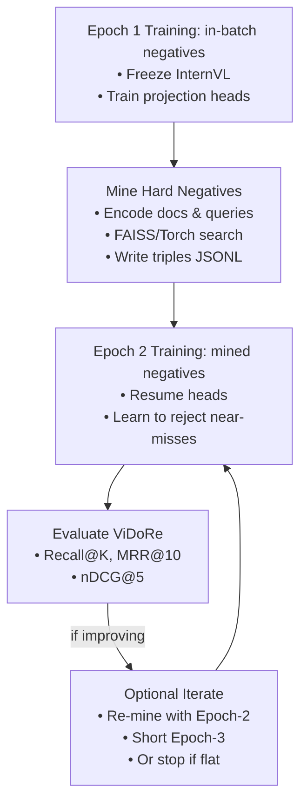

# ColIntern: End-to-End Process (Technical + Plain Language)

This document explains the full ColIntern pipeline in **technical terms** and in **plain language**, with a visual diagram.

---

## Visual Overview

---

## Technical Explanation (Step-by-Step)

### 1) Epoch-1 Training (In-Batch Negatives)
**What:** Train only the two projection heads (for queries and images) on the ColPali train set. InternVL stays frozen. Negatives are other images in the same batch.  
**Why:** Establishes a rough alignment between query tokens and page tokens so the model starts retrieving relevant pages.

### 2) Hard Negative Mining
**What:** Use the epoch-1 checkpoint to search the training collection and retrieve top-K candidate pages for each query. Keep the **false positives** (hard negatives) and write them to a JSONL triples file.  
**Why:** In-batch negatives are easy; hard negatives are the confusing near-misses that force the model to learn precise distinctions.

### 3) Epoch-2 Training (Mined Negatives)
**What:** Train again, feeding each query its true page **plus** mined hard negatives. Resume from epoch-1 heads.  
**Why:** This produces a significant jump in retrieval quality by teaching the model to demote lookalike or misleading pages.

### 4) Evaluation
**What:** Evaluate on ViDoRe (v1 QA or v2 BEIR) using Recall@K, MRR@10, nDCG@5 (optionally pooled + rerank).  
**Why:** These metrics directly reflect retrieval performance and let you compare with baselines like ColQwen or ColPali.

### 5) (Optional) Iterate
**What:** If metrics plateau, you’re done. If they still improve, **re-mine** with the epoch-2 checkpoint and run a short epoch-3.  
**Why:** Additional rounds can squeeze out extra gains when chasing leaderboard results.

---

## Plain Language Analogy

1. **First practice (epoch-1):** The student learns the basics by seeing the correct page and some obviously wrong ones from the same pile.  
2. **Collect tricky mistakes (mining):** We record which wrong pages the student confused with the correct one.  
3. **Second practice (epoch-2):** The student practices again but now with those tricky wrong pages — becoming much sharper.  
4. **Test the student (evaluation):** We grade performance on a new exam and see how often they get the right page in the top 1, 5, or 10.  
5. **Extra practice (optional):** If they’re still improving, we gather new tricky examples and do a short extra round; otherwise, we stop.

---

### TL;DR
- **Epoch-1** builds the initial alignment.  
- **Mining** finds the hard mistakes.  
- **Epoch-2** fixes those mistakes.  
- **Evaluation** tells us how good we are.  
- **Iteration** adds polish if needed.
